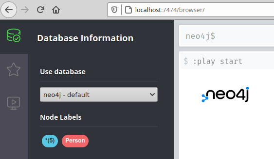
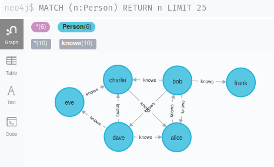

Exploring a network dataset with sqlite3 (SQL) and neo4j (Cypher)

# Using Neo4J

- you will need Docker to run this example
- the current Neo4J manual is available [here](https://neo4j.com/docs/cypher-manual/current/)

Neo4J is a Graph Database. Instead of tables, it stores nodes and edges (aka relationships). That allows us to represent and query data like an organisational hierarchy, a social network or links between webpages in a natural and flexible way.

This repo contains an example Neo4J database setup, in [run.sh](run.sh).
It will run Neo4J in a docker container, loading the nodes and edges contained in the [import](import/) directory.

Once started, you can access the database on http://localhost:7474/. Authentication has been disabled for this example, so you can just click "connect" and you will connect to the database.

Open the Database Information tab (top right) and click the "Person" node label, as shown below:



You will see the small graph of relationships we have loaded.



Enter Cypher queries in the box at the top of the page. You can find a description of cypher language in the [manual](https://neo4j.com/docs/cypher-manual/current/). The section on [patterns](https://neo4j.com/docs/cypher-manual/current/syntax/patterns/) will be helpful in understanding how we find particular structural patterns in the dataset.

A few examples:

### Who does Dave know?

```SQL
MATCH (dave:Person {name:"dave"}) -[:knows]-> (b:Person)
RETURN b
```
Result:
eve

### Who knows Dave?

```SQL
MATCH (dave:Person {name:"dave"}) <-[:knows]- (b:Person)
RETURN b
```
Result:
bob, charlie

### Who could introduce Dave to someone new?

```SQL
MATCH (dave:Person {name:"dave"}) -[:knows]-> (b:Person)
MATCH (b) -[:knows] -> (c:Person)
WHERE NOT (dave) -[:knows]-> (c)
RETURN b,c
```
Result:
eve could introduce dave to charlie

### Who could directly introduce Dave to Frank?

```SQL
MATCH (dave:Person {name: "dave"}) -[:knows]->(p:Person)
MATCH (p) -[:knows]-> (frank:Person {name: "frank"})
RETURN p
```
Result: none

### Who could introduce introduce Dave to someone who could eventually introduce them to Frank?

```SQL
MATCH (dave:Person {name: "dave"}) -[:knows]->(p:Person)
MATCH (p) -[:knows*]-> (frank:Person {name: "frank"})
RETURN p
```
Result:
alice, charlie or eve

Note that charlie and eve are redundant here. They are present because they know alice, who can make a path to frank.

### How could Dave be introduced to Frank in the smallest number of introductions?

```SQL
MATCH
 p = shortestPath((:Person {name: "dave"}) -[:knows*]-> (:Person {name: "frank"})) 
RETURN nodes(p)
```
Result:
dave -> alice -> bob -> frank